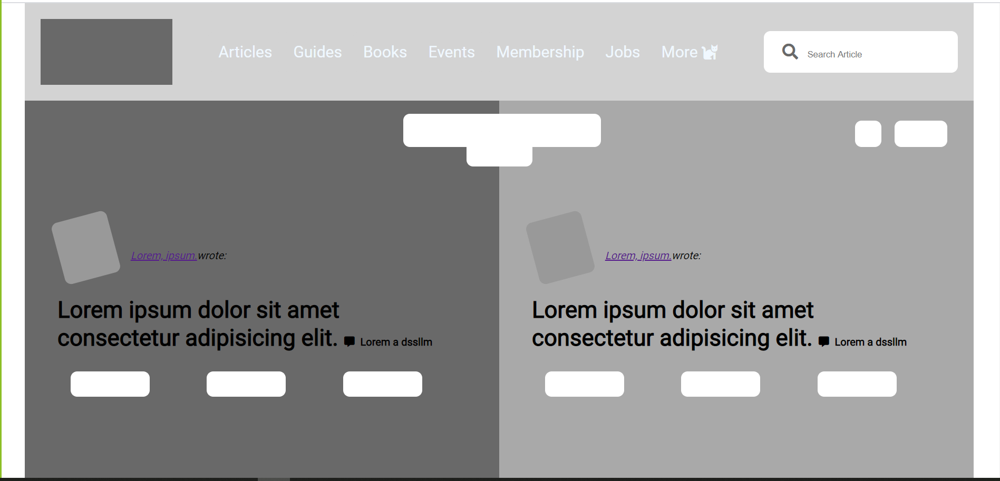

# Smashing Magazine heat-map

> A heat-map for the Main Page.

## Built With

- HTML5
- CSS3

## Live Demo

[Live Demo Link](https://martinnajjar12.github.io/heat-map-smashing-magazine/)

## Authors

👤 **Kevin Cotrina**

- Github: [@githubhandle](https://github.com/kcotrinam92)
- Twitter: [@twitterhandle](https://twitter.com/KevinCot12)
- Linkedin: [linkedin](https://www.linkedin.com/in/kevin-cotrina-6208b7149/)

👤 **Martin Najjar**

- Github: [@githubhandle](https://github.com/martinnajjar12)
- Twitter: [@twitterhandle](https://twitter.com/martin_najjar)
- Linkedin: [linkedin](https://www.linkedin.com/in/martin-najjar-174948198/)

## 🤝 Contributing

Contributions, issues and feature requests are welcome!

Feel free to check the [issues page](https://github.com/martinnajjar12/heat-map-smashing-magazine/issues).

## Show your support

Give a ⭐️ if you like this project!

## Acknowledgments

- Heat Map for the [Smashing Magazine website](https://www.smashingmagazine.com/)

## 📝 License

This project is [MIT](lic.url) licensed.
